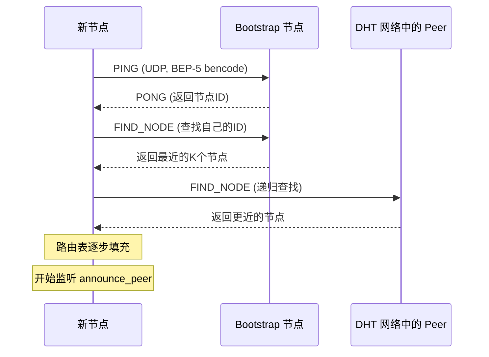
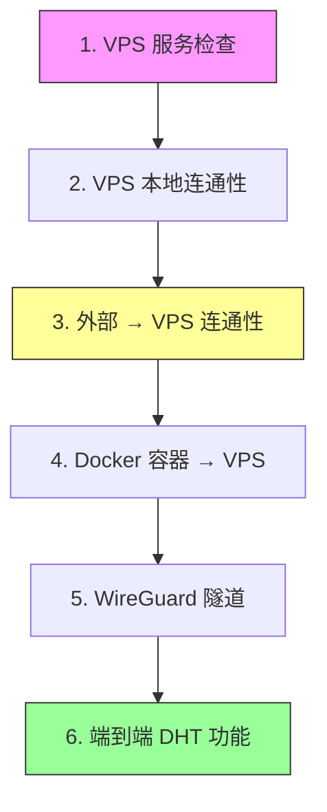
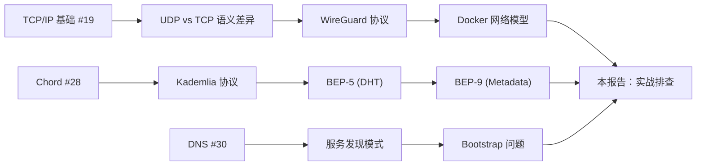

# DHT 实战排查：从协议理论到工程故障诊断

> 基于 bitmagnet DHT 爬虫的真实故障排查经验，串联 DHT/Kademlia 协议理论、网络隧道架构设计、分层故障诊断方法论。
> 创建日期：2026-04-06
> 关联精读：Chord (#28)、TCP/IP (#19)、DNS (#30)

---

## 一、背景：问题定义

### 1.1 系统目标

bitmagnet 是一个 BitTorrent DHT 爬虫，通过加入 DHT 网络被动监听 `announce_peer` 和 `get_peers` 消息来发现新种子。核心依赖：

- **DHT 协议（BEP-5）**：基于 Kademlia 的分布式哈希表，使用 UDP 协议
- **Bootstrap 机制**：新节点通过联系已知的 bootstrap 节点加入网络
- **元数据获取**：通过 BEP-9 (Extension for Peers to Send Metadata Files) 从 peer 获取种子元信息

### 1.2 运行环境约束

| 层 | 组件 | 约束 |
|------|------|------|
| 宿主机 | macOS + Docker Desktop | VPNKit 对 UDP 支持有限 |
| 代理 | Clash Verge (TUN 模式) | 劫持所有出站流量，包括 Docker |
| VPN | WireGuard → AWS VPS | 提供干净的公网出口 |
| 应用 | bitmagnet (Go) | 需要 UDP 双向通信 |

**核心矛盾**：DHT 是 UDP 协议，而本地网络栈被多层代理/隧道包裹，每一层都可能破坏 UDP 通信。

---

## 二、理论基础：DHT 网络的加入过程

### 2.1 Kademlia Bootstrap 流程



**关键点**：
- 整个过程基于 **UDP**，不像 HTTP 有 TCP 握手保证
- Bootstrap 节点是**硬编码的已知入口**，如果全部不可达，节点永远无法加入网络
- BEP-5 消息使用 **bencode 编码**，一个合法的 PING 请求：`d1:ad2:id20:<20字节node_id>e1:q4:ping1:t2:aa1:y1:qe`

### 2.2 Bootstrap 节点的生态现状

主流 BT 客户端的默认 bootstrap 节点（2026-04 实测）：

| 节点                            | 维护方                  | 协议  | 状态           |
| ----------------------------- | -------------------- | --- | ------------ |
| `router.bittorrent.com:6881`  | BitTorrent Inc.      | UDP | **死亡**       |
| `router.utorrent.com:6881`    | BitTorrent Inc.      | UDP | **死亡**       |
| `dht.transmissionbt.com:6881` | Transmission         | UDP | 存活           |
| `dht.libtorrent.org:25401`    | libtorrent (@arvidn) | UDP | 存活           |
| `dht.aelitis.com:6881`        | Vuze/Azureus         | UDP | **死亡**       |
| `router.silotis.us:6881`      | 社区 (IPv6)            | UDP | **DNS 解析失败** |

**启示**：6 个主流 bootstrap 节点中仅 2 个存活（33%）。BitTorrent 官方节点已长期失效。这是一个**单点故障风险** — 如果 Transmission 和 libtorrent 的节点也下线，整个公共 DHT 网络的新节点加入将受到严重影响。

---

## 三、网络架构：多层隧道设计

### 3.1 最终架构

```
bitmagnet (Go, UDP:3334)
    │ network_mode: service:gluetun
    ▼
gluetun (WireGuard 客户端, tun0)
    │ WireGuard UDP → 封装为 UDP 包
    ▼
wstunnel 客户端 (Docker, 192.168.55.9)
    │ UDP:51820 → WebSocket (TCP:8080)
    ▼
────── Docker Desktop VPNKit ──────
    │ TCP 可以正常穿越
    ▼
────── macOS 网络栈 (Clash Verge TUN) ──────
    │ TCP:8080 → Clash → 代理出口/直连
    ▼
────── Internet ──────
    │
    ▼
VPS (AWS EC2, us-west-2)
    │ wstunnel 服务端 (TCP:8080 → UDP:51820)
    ▼
WireGuard 服务端 (UDP:51820)
    │ 解封装 → NAT MASQUERADE
    ▼
Internet (公网 IP 出口)
```

### 3.2 为什么需要 wstunnel

Docker Desktop for Mac 使用 VPNKit 做网络虚拟化，它对 UDP 的支持是**有限且不可靠的**。直接在容器内建立 WireGuard 连接（UDP:51820 → VPS），UDP 包经过 VPNKit 后可能丢失或乱序。

wstunnel 的作用是：**将 UDP 封装进 WebSocket（TCP）**，绕过 VPNKit 的 UDP 限制。TCP 在 VPNKit 中是完全可靠的。

### 3.3 端口转发：让外部 peer 能连入

DHT 爬虫不仅要主动发现种子，还需要**被动接收**其他 peer 的请求。这要求 VPS 的公网端口能转发到 bitmagnet：

```bash
# VPS iptables DNAT（在 WireGuard PostUp 中配置）
iptables -t nat -A PREROUTING -i ens5 -p udp --dport 3334 \
  -j DNAT --to-destination 10.0.0.2:3334
iptables -A FORWARD -i ens5 -o wg0 -p udp --dport 3334 -j ACCEPT
```

流量路径：`外部 peer → VPS:3334 → iptables DNAT → WireGuard 隧道 → gluetun → bitmagnet`

---

## 四、故障排查：分层诊断方法论

### 4.1 故障现象

bitmagnet 的 DHT 状态持续为 `down`，错误信息 `no response within 30 seconds`。

### 4.2 分层诊断法

网络故障排查的核心方法是**分层隔离**。从最外层开始，逐层验证每一跳是否正常：



### 4.3 实际排查过程与发现

#### 第一层：VPS 服务状态 ✅

```bash
# VPS 上检查
ps aux | grep wstunnel    # wstunnel server 在运行
ss -tlnp | grep 8080      # 端口在监听
ss -ulnp | grep 51820     # WireGuard 在监听
```

#### 第二层：VPS 本地回环 ✅

```bash
# VPS 上 curl 自己
curl -v http://127.0.0.1:8080/
# → HTTP/1.1 400 Bad Request (正常，wstunnel 拒绝非法请求)
```

#### 第三层：外部 → VPS ❌ 问题发现！

```bash
# 从 Mac 本机
curl -v --max-time 5 http://100.23.62.114:8080/
# → Connected! 但 0 bytes received，超时

# VPS 上同时抓包
sudo tcpdump -i ens5 port 8080 -c 10 -nn
# → 0 packets captured !!!
```

**关键发现**：TCP 显示 "Connected" 但 VPS 收到 0 个包。这意味着：
- **TCP 握手被中间层（Clash Verge）代理完成**，并非真正到达 VPS
- 或者 **AWS 安全组阻止了入站流量**

#### 根因定位：AWS 安全组

用户确认安全组 TCP 只开了 22 端口。**8080 未开放**。

但为什么 curl 显示 "Connected"？因为 Clash Verge 的 TUN 模式拦截了所有出站连接，TCP 握手实际上是 Clash 在本地完成的（作为代理）。Clash 尝试转发时，因安全组阻止而失败，但 Clash 不会立即向客户端报告错误，而是静默等待直到超时。

#### 修复后的第二个问题：DHT 仍然 down

安全组开放 8080 后，WireGuard 隧道建立成功（gluetun 健康检查通过，公网 IP 显示为 VPS IP），但 DHT 状态仍为 down。

**诊断方法**：直接在 VPS 上用 Python 发送真实的 DHT PING 验证 bootstrap 节点：

```python
import socket
msg = b'd1:ad2:id20:abcdefghij0123456789e1:q4:ping1:t2:aa1:y1:qe'
s = socket.socket(socket.AF_INET, socket.SOCK_DGRAM)
s.settimeout(3)
s.sendto(msg, ('router.bittorrent.com', 6881))
data, addr = s.recvfrom(1024)  # timeout — 节点已死
```

**发现**：docker-compose.yml 中配置的 14 个 bootstrap 节点，仅 2 个存活。

---

## 五、故障总结：两个独立的根因

| # | 根因 | 症状 | 影响层 | 修复方式 |
|---|------|------|--------|----------|
| 1 | AWS 安全组未开放 TCP 8080 | wstunnel WebSocket 握手失败，WireGuard 隧道无法建立 | 网络层 | 开放 TCP 8080、UDP 51820、UDP/TCP 3334 |
| 2 | DHT bootstrap 节点大面积失效 | bitmagnet 无法加入 DHT 网络 | 应用层 | 更新节点列表为存活节点 |

**为什么两个问题同时出现？** 因为之前可能从未成功建立过隧道（安全组一直没开），所以 bootstrap 节点失效的问题也被掩盖了。只有修复第一个问题后，第二个问题才暴露出来。这是**故障遮蔽**的典型案例。

---

## 六、工程经验提炼

### 6.1 分层诊断的通用框架

任何涉及多层网络的系统，排查时应遵循：

1. **从最内层开始验证**：先确认目标服务本身是否正常（本地回环测试）
2. **逐层向外扩展**：每次只跨越一个边界（Docker 网络 → 宿主机 → 公网）
3. **使用抓包确认数据是否到达**：`tcpdump` 是最可靠的手段，不依赖应用层协议
4. **区分"连接成功"和"通信成功"**：代理环境下 TCP Connected 不等于数据真正到达目标

### 6.2 代理环境下的陷阱

| 现象 | 真实情况 | 诊断方法 |
|------|----------|----------|
| curl 显示 "Connected" | 代理在本地完成了握手 | 目标端 tcpdump 验证 |
| TCP 通但 UDP 不通 | Docker Desktop VPNKit 的 UDP 限制 | 用 wstunnel 封装 UDP→TCP |
| DNS 解析正常但连接超时 | 安全组/防火墙阻止了端口 | 检查云平台安全组规则 |
| 隧道通但应用不工作 | 应用层配置问题（如 bootstrap 节点失效） | 直接测试应用层协议 |

### 6.3 DHT 网络的脆弱性

从 Chord 论文的理论视角来看，DHT 设计假设：
- **节点会频繁加入和离开**（churn），通过 stabilization 协议维护路由表
- **Bootstrap 是冷启动的关键路径**，如果所有已知入口都不可达，节点无法加入

实际工程中的风险：
- 公共 bootstrap 节点由少数组织维护，缺乏冗余（6 个节点中 4 个已死）
- 没有标准化的 bootstrap 节点发现机制（不像 DNS 有根服务器体系）
- **建议**：自建 bootstrap 节点（如 jech/dht-bootstrap），不依赖第三方服务

### 6.4 敏感信息管理教训

排查过程中在 docker-compose.yml 中硬编码了 WireGuard 私钥和 VPS IP，提交前需要：
- 所有密钥、IP 改为 `${ENV_VAR}` 引用
- `.gitignore` 添加 `*.pem`、`wireguard/`、`wg0.conf`
- `.env.example` 提供变量模板但不含真实值

---

## 七、与已有知识的关联

### 7.1 Chord (#28) → Kademlia → BEP-5

| 概念 | Chord 论文 | Kademlia/BEP-5 实际 |
|------|-----------|---------------------|
| 节点标识 | m-bit 哈希环上的位置 | 160-bit SHA-1 node ID |
| 路由表 | Finger Table (O(log N) 条目) | K-bucket (按 XOR 距离分组) |
| 查找复杂度 | O(log N) 跳 | O(log N) 跳 |
| 节点发现 | successor/predecessor 稳定化 | FIND_NODE 递归查询 |
| Bootstrap | 需要已知一个节点 | 硬编码 bootstrap 节点列表 |

### 7.2 TCP/IP (#19) → 分层模型的实践

本次排查完美体现了 TCP/IP 分层模型的价值：
- L3 (IP)：安全组阻止了数据包到达
- L4 (TCP)：代理在本地完成握手，掩盖了 L3 问题
- L7 (Application)：bootstrap 节点失效是独立的应用层问题

每一层的故障需要在**对应层级的工具**来诊断（tcpdump → netstat → 应用协议测试）。

### 7.3 DNS (#30) → 域名解析的重要性

bootstrap 节点使用域名而非 IP 的优势在排查中得到验证：
- `dht.transmissionbt.com` 的 IP 从 `87.98.162.88` 变为 `212.129.33.59`
- 如果只硬编码 IP，服务器更换后客户端就会失联
- 这与 DNS 设计的核心思想一致：**间接层（域名）解耦了服务身份和物理位置**

---

## 八、学习路径建议

### 如果你想深入理解本报告涉及的技术栈：



### 推荐阅读顺序：
1. **Chord 论文** → 理解 DHT 的数学基础（已有精读 #28）
2. **Kademlia 原始论文 (Maymounkov & Mazières, 2002)** → XOR 距离度量的精妙设计
3. **BEP-5 规范** → BitTorrent DHT 的实际协议细节
4. **WireGuard 白皮书 (Donenfeld, 2017)** → 现代 VPN 协议设计
5. **Docker 网络文档** → 理解 bridge/host/overlay 网络模型和 VPNKit 的局限

---

## 九、未解问题

1. **DHT bootstrap 的去中心化替代方案**：是否有可能像 DNS 根服务器那样建立一个更健壮的 bootstrap 基础设施？
2. **Clash TUN 模式对 UDP 的具体行为**：在什么条件下 Clash 会正确转发 UDP，什么条件下会失败？
3. **Docker Desktop 的 UDP 支持演进**：Apple 的 Virtualization.framework（替代 VPNKit）是否改善了 UDP 支持？
